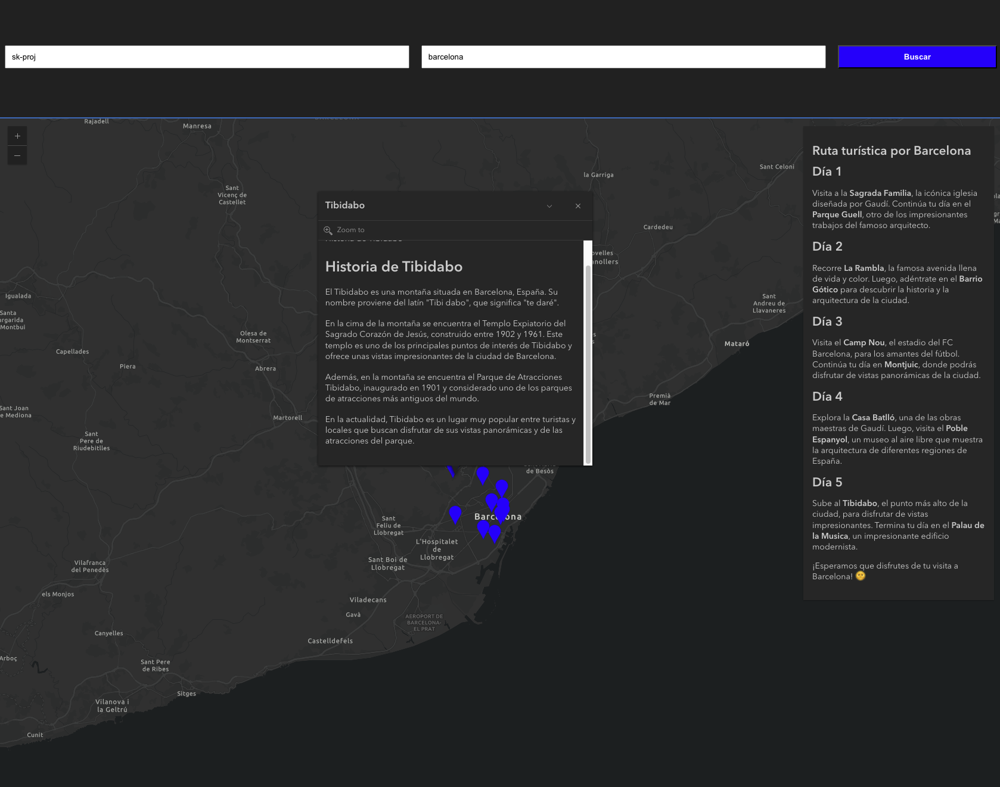
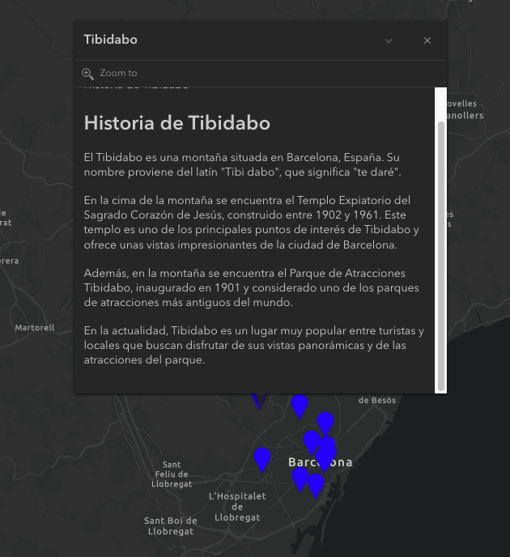
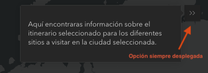
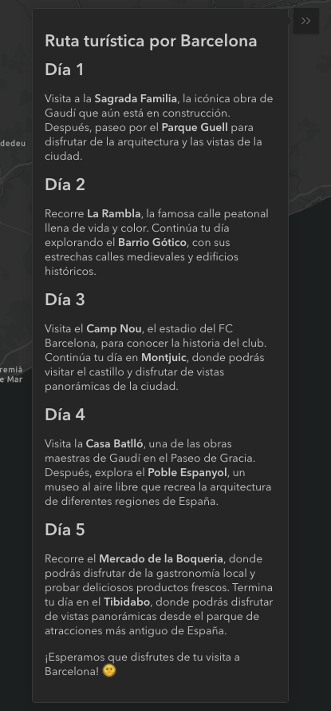

# Guía de viaje

## Descripción

Está aplicación web genera una guía turística con ChatGPT, donde te recomienda sitios para visitar según la ciudad que quieras visitar.

## Uso

1. Existen 2 inputs:
    - El primer input es para ingresar la api key de ChatGPT. Este campo es obligatorio para que la aplicación funcione (una vez ingresado, no se debe borrar, ya que no se guarda esta información).
    - El segundo input es para ingresar la ciudad que deseas visitar. Este valor cda que se cambie, se debe presionar el botón "Buscar" o dar enter en el teclado para que se actualice la información en el mapa.

2. Una vez ingresado el api key y la ciudad, se mostrará un mapa con la ubicación de la ciudad y una serie de pines de sitios turísticos recomendados por ChatGPT.

3. Al hacer click en un pin, se mostrará una ventana con la información del sitio turístico recomendado generada con ChatGPT.

4. Al hacer click en el botón "<<" (se encuentra en la parte superior derecha del mapa, por default está expandido para mostrar la información.) se mostrará una ventana con la guía por días para visitar todos los sitios recomendados generada con ChatGPT.

## 🧞 Comandos

Todos los comandos se ejecutan desde la raíz del proyecto, desde una terminal:

| Command                   | Action                                           |
| :------------------------ | :----------------------------------------------- |
| `npm install`             | Instalar dependencias                            |
| `npm run dev`             | Iniciar servidor local dev en `localhost:4321`      |
| `npm run build`           | Construir sitio de producción para `./dist/`          |
| `npm run preview`         | Vista previa del compilado local, antes de implementarla     |
| `npm run astro ...`       | Ejecutar comandos CLI como `astro add`, `astro check` |
| `npm run astro -- --help` | Obtener ayuda usando Astro CLI                     |
